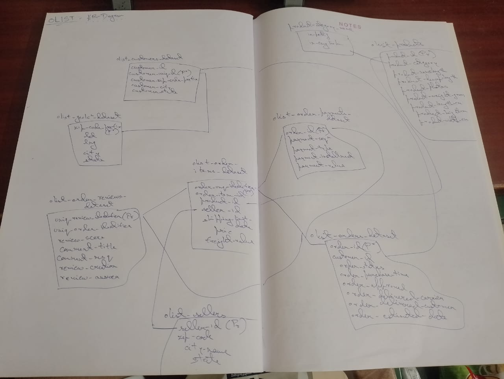
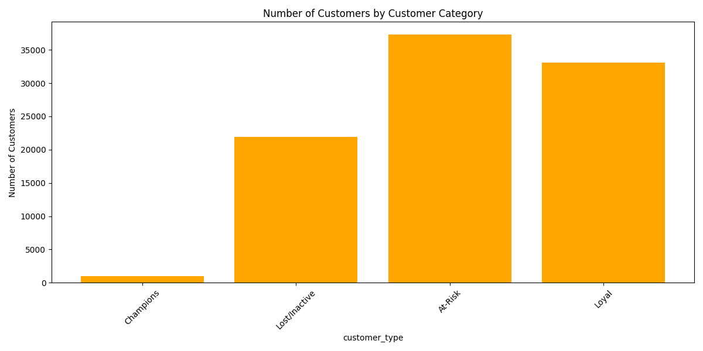
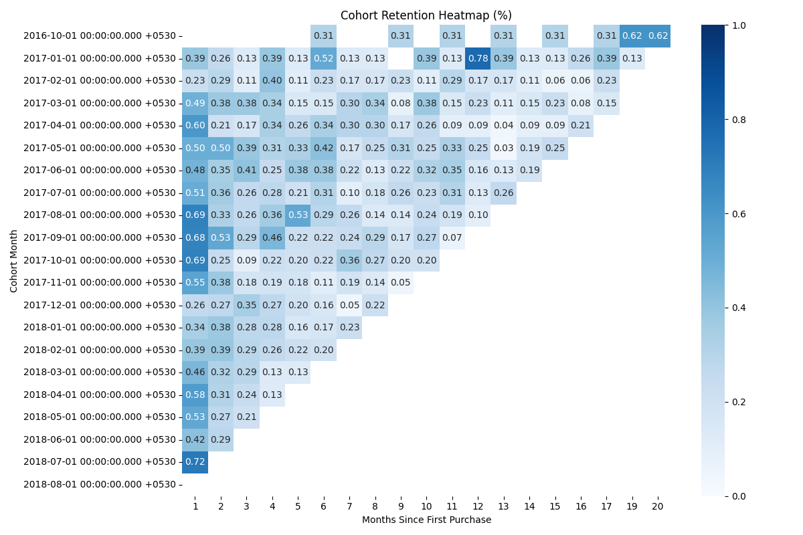
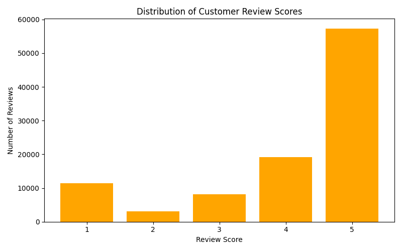
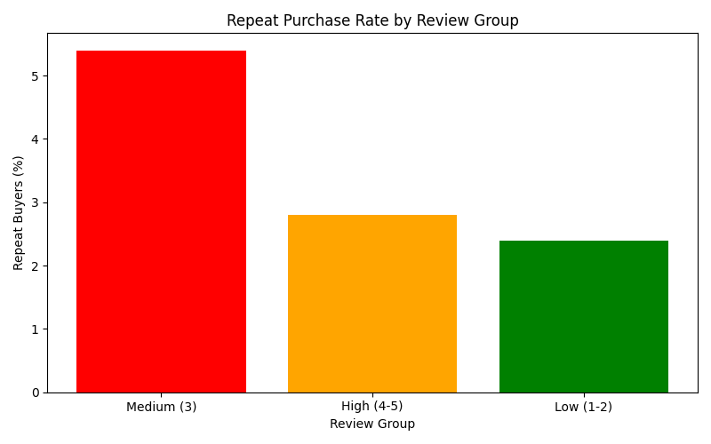
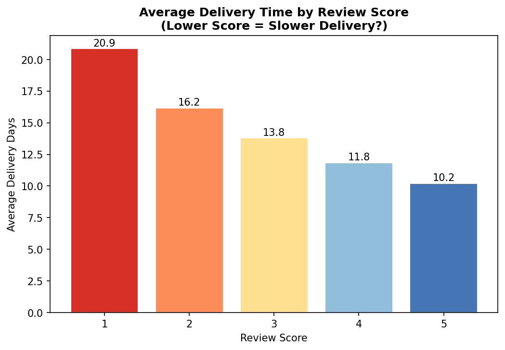
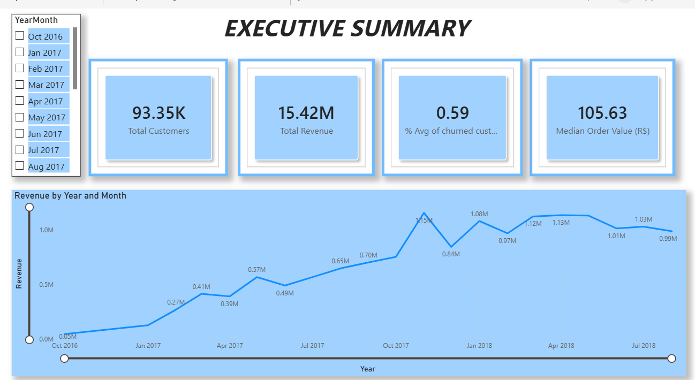
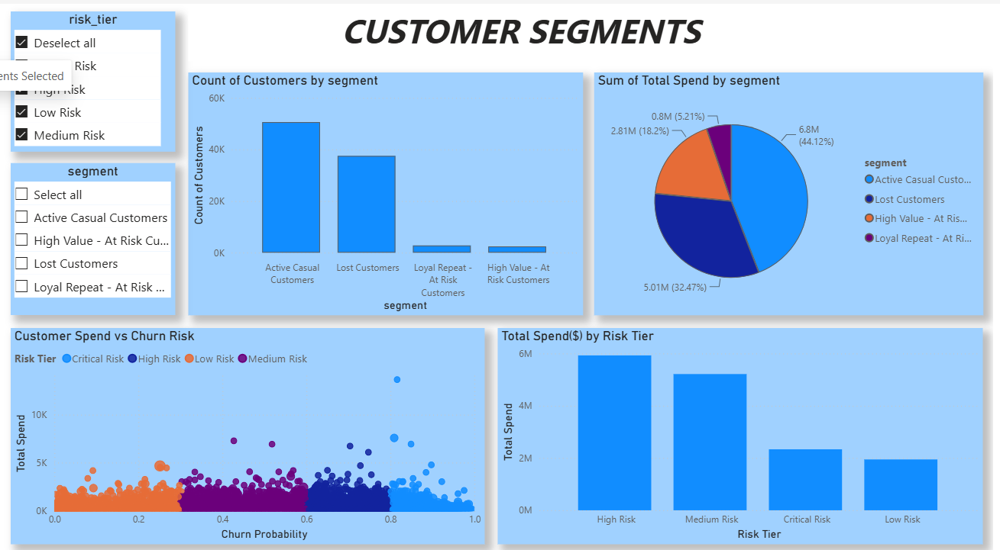
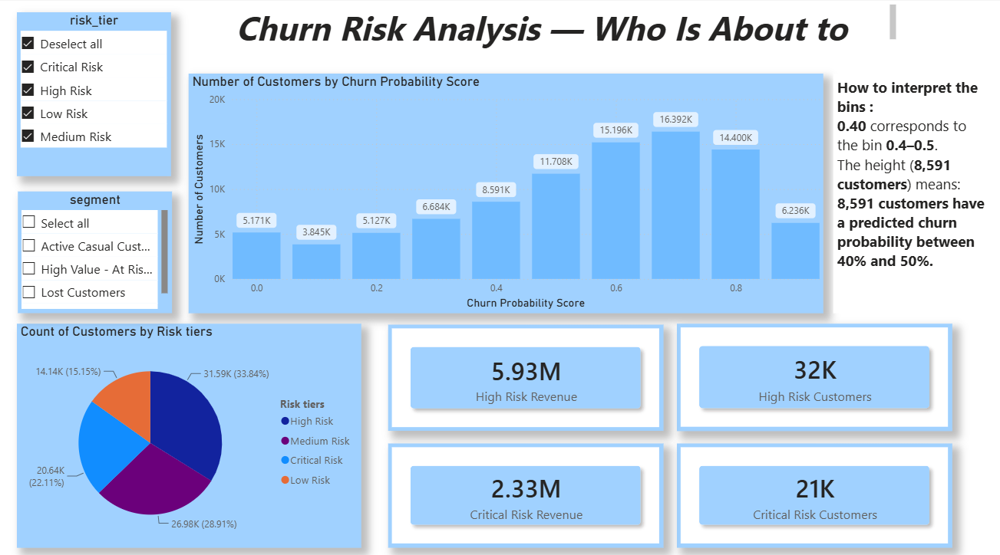
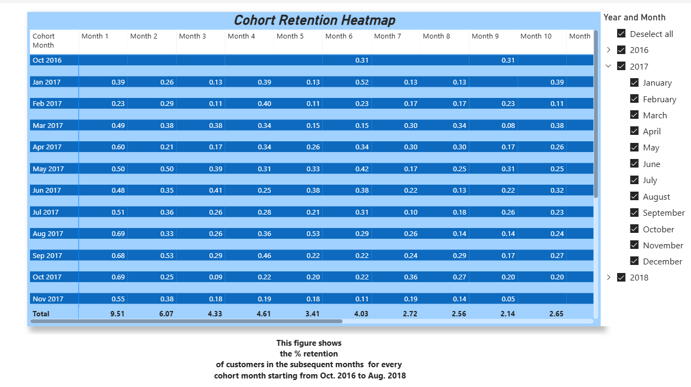

# 🛍️ Olist E-Commerce Customer Intelligence System
**End-to-End Analytics** | `SQL` · `Python` · `XGBoost` · `SHAP` · `Power BI`

---

## Project Overview

Olist is Brazil's largest e-commerce marketplace. Between 2016 and 2018, it processed over 99,000 orders across 96,000+ unique customers — yet all that behavioral data sat fragmented across 9 relational tables with no unified customer view. The business had no way to answer the questions that matter most: *Who are our most valuable customers? Which ones are about to leave? How much revenue is at risk, and what do we do about it?*

This project builds a complete customer intelligence system from scratch — starting from raw CSVs, working through SQL exploration, Python feature engineering, unsupervised segmentation, supervised churn prediction with SHAP interpretation, and ending with a Power BI dashboard and a quantified retention campaign strategy.

---

## Dataset

**[Olist Brazilian E-Commerce Public Dataset — Kaggle](https://www.kaggle.com/datasets/olistbr/brazilian-ecommerce)**  
9 relational tables · 99,441 orders · 96,096 unique customers · Sep 2016 – Oct 2018

---

## Core Business Problems Addressed

* **No Customer Segmentation:** Every customer was being treated identically regardless of value or behavior.
* **No Churn Visibility:** The business had no signal for which customers were about to stop buying.
* **No Revenue Quantification:** The cost of customer inactivity was never translated into actual currency (R\$).
* **Unclear Retention Levers:** The business didn't know what was actually driving customers away — delivery? product? pricing?
* **Acquisition-Only Growth:** Platform revenue had plateaued because all growth was coming from new customers, with no investment in retaining existing ones.

---

## Key Results

| Metric | Value |
| :--- | :--- |
| **Total Customers Analysed** | 93,350 |
| **Total Platform Revenue (2016–2018)** | R\$15.42M |
| **Overall Churn Rate** | 59% |
| **Top 25% of Customers → Revenue Share** | ~60% of total revenue |
| **Best Model (XGBoost) AUC-ROC** | 0.812 (hold-out) · 0.858 ± 0.005 (5-fold CV) |
| **#1 Churn Driver (SHAP)** | `avg_delivery_delta` — actual vs. promised delivery time |
| **High-Risk Customers** | 30,200 customers · R\$5.93M revenue at risk |
| **Retention Campaign ROI (10% retention)** | **93%** |

---

## Business Findings & Strategic Insights

* **Revenue is dangerously concentrated:** The top 25% of customers generate ~60% of revenue. Losing a handful of high-value customers has an outsized impact — a broad, undifferentiated marketing strategy misses this entirely.
* **This platform has a conversion problem, not a satisfaction problem:** 59% of customers churned, and 94% of customers placed only one order ever. The dominant challenge isn't keeping happy customers loyal — it's converting good one-time buyers into second-time buyers before they drift away.
* **Delivery experience, not review score, is the root cause of churn:** 1-star customers waited an average of 20.9 days for delivery vs. 10.2 days for 5-star customers. SHAP analysis confirmed `avg_delivery_delta` and `avg_delivery_days` as the top two churn predictors — review score ranked much lower because it's largely downstream of delivery, not an independent driver.
* * **R\$8.80M in revenue sits in the hands of High and Critical-Risk customers:** A targeted campaign at the High-Risk group alone (30,200 customers) is estimated to recover R\$583,608 at a campaign cost of R\$302,000 — a **93% ROI**, breaking even at a retention rate as low as 5.2%.

---

## Tech Stack

| Domain | Technology / Library | Usage |
| :--- | :--- | :--- |
| **Data Storage & SQL** | PostgreSQL, DBeaver | Relational database modeling & analytical queries |
| **Data Processing** | Python, pandas, NumPy | Data cleaning, ETL, and feature engineering |
| **Machine Learning** |  scikit-learn (CalibratedClassifierCV), XGBoost | Customer segmentation, churn modeling, and validation |
| **Model Interpretability** | SHAP | Feature attribution & dependency analysis |
| **Visualisation** | matplotlib, seaborn | Exploratory data analysis & statistical plotting |
| **Business Dashboard** | Power BI Desktop | Interactive reporting, KPI tracking & scenario modeling |
| **Environment** | Jupyter Notebook | End-to-end reproducible analysis notebooks |

---

## Project Structure

```text
Olist_E-Commerce_Analysis/
│
├── Visualizations/
│   └── EDA_and_Feature_Engineering_Plots/
│       ├── cohort_retention_heatmap.png
│       ├── distribution_of_delivery_times.png
│       ├── distribution_of_review_score.png
│       ├── number-of-customers-by-cohorts.png
│       ├── repeat_buyers_by_review_group.png
│       ├── revenue-metric-by-cohorts.png
│       ├── rf-revenue-by-category.png
│       └── rfm-segmentation.png
│
├── dashboards&buisness_quantification/
│   ├── Buisness_Quantification.ipynb
│   ├── Phase-03_PowerBI_README.md
│   ├── churn_analysis.png
│   ├── churn_risk_summary.csv
│   ├── cohort_rentention_heatmap.png
│   ├── customer_features_with_segments.csv
│   ├── customer_segments.png
│   ├── executive_summary.png
│   └── segment_summary.csv
│
├── exports-results/
│   ├── cohort_analysis.csv
│   ├── cohort_retention_analysis.csv
│   ├── no_of_customers_per_category.csv
│   ├── order_delivery_percentiles.csv
│   ├── percentage_of_total-revenue_by_category.csv
│   ├── product_category_by_revenue.csv
│   ├── repeat_buyers_by_review_group.csv
│   ├── retention_matrix_df.csv
│   ├── revenue_trend_per_month.csv
│   ├── review_score_distribution.csv
│   └── states_by_revenue.csv
│
├── notebooks/
│   ├── CHURN_MODEL_and_SHAP.ipynb
│   ├── Phase_02-Python_part_22-06-2026.ipynb
│   ├── Phase_02-README.md
│   ├── Python_Phase_02_Segmentation_Analysis_KMeans_and PCA.ipynb
│   ├── SQL_Visualizations.ipynb
│   ├── customer_features_final_calibrated.csv
│   └── xgb_churn_model_calibrated.pkl
│
├── sql/
│   ├── Basic_Exploration_Queries.sql
│   ├── Cohort_Retention_Analysis.sql
│   ├── Funnel_Analysis.sql
│   ├── Olist_dataset_ER-Diagram.jpeg
│   ├── Phase-01_SQL_Readme.md
│   └── RFM_Segmentationsql.sql
│
├── Buisness Report.md              ← Non-technical findings and recommendations
└── README.md                       ← Main documentation
```

# ⚙️ Analysis Pipeline & Dashboard Documentation

---

## Analysis Pipeline

### Phase 1 — SQL Exploration (`PostgreSQL`)

* Built relational database from 9 raw CSVs (`sql/Olist_dataset_ER-Diagram.jpeg`); identified `customer_id` vs `customer_unique_id` data quality issue.


* **Funnel Analysis (`sql/Funnel_Analysis.sql`):** Evaluated order progression across statuses (delivered, canceled, unavailable, shipped).
* **Revenue Concentration:** Top 25% of customers → ~60% of revenue (Pareto confirmed).
* **Delivery Time Percentiles:** Median 10 days, p90 = 23 days — 1-in-10 customers wait significantly longer.
* **RFM Segmentation (`sql/RFM_Segmentationsql.sql`):** Champions (985), Loyal (33,090), At-Risk (37,344), Lost/Inactive (21,938).
* **Cohort Retention (`sql/Cohort_Retention_Analysis.sql`):** Consistently low across all cohorts; business growth is entirely acquisition-driven.


*Figure 1: Customer counts by RFM segment.*


*Figure 2: Cohort retention matrix.*

---

### Phase 2 — Python: Feature Engineering, Segmentation & Churn Prediction
*(`pandas` · `scikit-learn` · `XGBoost` · `SHAP`)*

* **Notebooks:** `notebooks/Phase_02-Python_part_22-06-2026.ipynb`, `notebooks/Python_Phase_02_Segmentation_Analysis_KMeans_and PCA.ipynb`, `notebooks/CHURN_MODEL_and_SHAP.ipynb`
* Merged 9 tables into a clean master table (`notebooks/customer_features_final.csv`) with payment sanity checks.
* Engineered 20 customer-level features including `avg_delivery_delta`, `avg_freight_ratio`, `has_review`, and `is_consumable_category`.
* **Data Leakage Catch:** First model version scored AUC ≈ 1.0 — traced to `avg_days_between_orders` encoding the churn label for single-order customers; fixed with `NaN` + `has_repeat_orders` flag.
* **K-Means Clustering:** (K=4, silhouette-validated) identified 4 segments independently, closely matching the SQL RFM results — confirming the pattern is real.
* **Final XGBoost Churn Model:** AUC 0.812 on hold-out · 0.858 ± 0.005 on 5-fold CV · Recall 86.5% (Model saved at `notebooks/xgb_churn_model.pkl`).
* **SHAP Model Interpretability:** Confirmed delivery metrics (`avg_delivery_delta`, `avg_delivery_days`) as #1 and #2 predictors; review score ranked much lower once delivery features were included.



*Figure 3: Breakdown of customer review scores.*


*Figure 4: Repeat purchasing behavior mapped against review scores.*  -- no clear-direct pattern


*Figure 5: Delivery Time vs Review.*


*Figure 6: SHAP Feature-Importance Plot.*

---

### Phase 3 — Power BI Dashboard & Business Quantification
*(`Power BI` · `Python`)*

* **Execution (`dashboards&buisness_quantification/Buisness_Quantification.ipynb`):** Scored all 93,350 customers with the saved calibrated XGBoost model (`notebooks/xgb_churn_model_calibrated.pkl`) to generate individual, probability-calibrated churn scores (`dashboards&buisness_quantification/customer_features_final_calibrated.csv`).
* Divided customers into 4 risk tiers (Low / Medium / High / Critical) by probability threshold (`dashboards&buisness_quantification/churn_risk_summary.csv`).
* **Quantified Revenue at Risk:** High-Risk segment = R\$5.81M; Critical-Risk = R\$2.99M.
* **Modelled Retention Campaign:** 30,200 customers, 10% retention rate, R\$302,000 cost → R\$583,608 revenue recovered · **93% ROI**.
* **Power BI Dashboard:** 4 interactive pages with `risk_tier` and `segment` slicers for full cross-filtering flexibility.
---

## Dashboard Preview

🔗 **[Live Dashboard →](https://app.powerbi.com/groups/6dd1d3b8-cdac-49cc-a583-fabf3976f13b/reports/4014130b-a980-410e-b78b-3e885a289194/046b7472e98a95da526b?experience=power-bi)**

The dashboard consists of 4 dynamic interactive pages:

| Page | What It Answers |
| :--- | :--- |
| **Executive Summary** | Overall business health — revenue trend, customers, churn rate, median order value |
| **Customer Segments** | Who customers are, how they spend, and where churn risk sits across segments |
| **Churn Risk Analysis** | How churn probability is distributed and how much revenue is in each risk tier |
| **Cohort Retention Heatmap** | What % of each monthly cohort came back in subsequent months |

### Page 1: Executive Summary


### Page 2: Customer Segments


### Page 3: Churn Risk Analysis


### Page 4: Cohort Retention Heatmap


---

## Model Limitations & Honest Assessment

### Why predictions compress toward the 30–60% range

The churn predictor rarely pushes predictions toward extreme values (0–20% or 80–100%).
This is a fundamental data limitation, not a modeling failure, explained by three factors:

**1. Feature distributions are nearly identical for churned and non-churned customers**
The strongest SHAP feature (`avg_delivery_delta`) has a mean of -11.0 days for active customers
and -11.4 days for churned customers — a difference of less than half a day. When the key features
barely differ between the two groups, the model cannot confidently push predictions to extremes.
This is the primary reason even the worst-case customer profile in the predictor tab scores ~41–55%
rather than 90%+.

**2. Recency was intentionally removed to prevent label leakage**
The 180-day churn label is defined entirely from recency (days since last purchase). Including
recency as a feature would give the model the answer directly — an AUC ≈ 1.0 that is
statistically meaningless. After removing it (and the related `avg_days_between_orders` leakage
for one-time buyers), the model predicts churn from second-order signals only: delivery quality,
spend patterns, and category type. In a real production deployment, recency would be available
as a live, non-leaky input since you'd score customers at a fixed weekly cadence rather than
defining the churn label from the same time window.

**3. High base churn rate creates a high prior**
With 59% of customers classified as churned, the model's baseline probability before seeing
any features is already near 0.59. The remaining features shift this baseline by smaller
amounts than you might expect, because they don't separate churned from non-churned customers
as cleanly as recency would.

### What this means in practice

The model is **discriminative** (AUC 0.812 — it correctly ranks higher-risk customers above
lower-risk ones) but not **perfectly calibrated** (the raw probabilities are not precise
absolute values). For the primary use case — ranking 93,350 customers to identify the top
30,000 to target for a retention campaign — ranking quality is what matters, and AUC is
the right metric for that. The predictor tab demonstrates the model's learned feature
relationships directionally: delivery lateness raises risk, early delivery lowers it,
high freight ratios raise it. The specific probability values should be interpreted as
relative scores, not precise estimates.

## Phase READMEs & Documentation Links

Each phase has its own detailed documentation and artifact directory:

* 📄 **[Phase 1 — SQL Analysis Documentation](sql/Phase-01_SQL_Readme.md)**
* 📄 **[Phase 2 — Python: EDA, Segmentation & Churn Modeling](notebooks/Phase_02-README.md)**
* 📄 **[Phase 3 — Dashboard & Business Quantification](dashboards&buisness_quantification/Phase-03_PowerBI_README.md)**
* 📊 **[Executive Business Report](Buisness%20Report.md)** *(Non-technical summary for stakeholders)*
* 📂 **[Exported Data Summaries](exports-results/)** *(Contains CSV outputs for category, retention, and revenue metrics)*

---

**Pavitra Bhargava** · *B.Tech , NIT Calicut and BS in Data Science , IIT Madras* · 2026

** Thanks to ChatGPT and Claude for assisting me with the code, concepts and structuring of analysis throughout this project ** 
